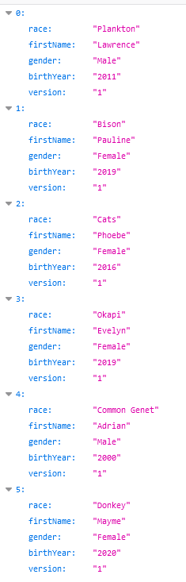
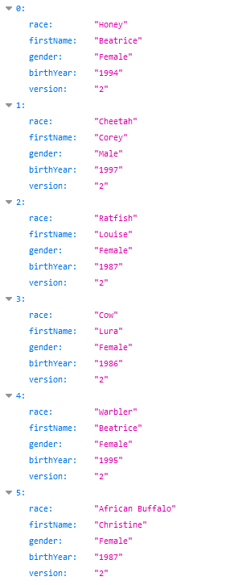

# 1. InfraHTTP

- [1. InfraHTTP](#1-infrahttp)
  - [1.1. Introduction](#11-introduction)
  - [1.2. Features](#12-features)
  - [1.3. Installation/Utilisation](#13-installationutilisation)
  - [1.4. Structure](#14-structure)
  - [1.5. Ajouts bonus](#15-ajouts-bonus)
  - [1.6. Tests effectués](#16-tests-effectués)
    - [1.6.1. Tests des sites statiques](#161-tests-des-sites-statiques)
    - [1.6.2. Tests des sites dynamiques](#162-tests-des-sites-dynamiques)
  - [1.7. Adaptation par rapport a la donnée](#17-adaptation-par-rapport-a-la-donnée)
  - [1.8 Conclusion](#18-conclusion)

## 1.1. Introduction

Dans ce rapport, nous allons décrire l'état actuel de notre infrastructure, et expliquer les diférentes parties qui la composent. Puis nous allons expliquer quels bonus nous avons décidé d'implémenter et comment, et montrerons comment nous avons vérifié le fonctionnement des différentes parties de l'interface, en nous concentrant surtout sur le test des deux parties bonus. Nous mentionerons les différents changements que nous avons du apporter par rapport aux vidéos fournies, et finirons par une conclusion.

Ce rapport ne s'occupe que de la description de l'état de notre infrastructure à la fin du développement. Nous avons décrit chaque étape telle qu'elle l'était à la fin de son développement dans un fichier md situé dans le dossier [doc](doc) : 

- [Etape-1](doc/Etape-1.md)
- [Etape-2](doc/Etape-2.md)
- [Etape-3](doc/Etape-3.md)
- [Etape-4](doc/Etape-4.md)
- [Etape.5](doc/Etape-5.md)

Pour retrouver l'état de l'étape à ce moment la dans le développement, veuillez changer de branche pour aller sur celle de l'étape de votre choix. Il existe une branche par étape dans le repo github du laboratoire, chacune nommée comme le fichier md qui la décrit : `Etape-x`

## 1.2. Features

En utilisant les 3 images que nous avons developpé notre interface permet : 

- D'offrir un site statique, qui peut être hebergé sur un ou plusieurs serveurs afin de repartir la charge.
- D'offrir un site qui fournit du contenu dynamique. Ce site est actuellement utilisé dans le site static pour rafraichir continuellement la page. 
- D'offrir un serveur reverse proxy, qui est capable de faire du load-balancing sur les différents serveurs disponibles, avec une implémentation en forme de sticky-session pour les serveurs statiques et round-robin pour les serveurs dynamiques.
- D'offrir une structure complétement modulable, qui peut être personalisée pour satifaire différents besoins.

## 1.3. Installation/Utilisation

Les instructions suivantes permettent de créer les différentes images que nous proposons, puis de lancer 2 containers a partir de l'image static, 2 à partir de l'image dynamic et un container qui sert de reverse_proxy. Si vous souhaitez avoir plus de serveurs d'un certain type, changer le host du site, changer le contenu d'un des deux sites,... lisez la documentation qui se trouve dans les fichiers md de chaque image.

Pour build les 3 images de l'infrastructure, il faut exécuter le script build-images :

```bash
./build-images.sh
``` 

Puis en exécutant le script start_containers vous pourrez lancer les 4 containers statiques et dynamiques de l'infrastructure : 

```bash
./start_containers.sh
```

Il ne suffit plus qu'à lancer le container du reverse proxy pour que l'infrastructure soit fonctionnelle. Pour lancer celui ci, il faut lancer la commande : 

```bash
docker run -d --name apache_rp -e STATIC_APP1=172.17.0.2:80 -e STATIC_APP2=172.17.0.3:80 -e DYNAMIC_APP1=172.17.0.4:3000 -e DYNAMIC_APP2=172.17.0.5:3000 -p 8080:80 res/apache_rp
```

Si vous n'aviez aucun container qui tournait lorsque vous avez commencé a lancer les containers pour cette infrastructure et que vous avez lancé d'abord les deux containers statiques, les adresses IP fournies ci-dessus devraient correspondre à celles des différentes instances de vos serveurs statique et dynamiques. Pour être cependant sur qu'elles sont correctes, nous vous conseillons de vérifier d'abbord les adresses des différents containers en utilisant la commande `docker inspect container_name | grep -i ipaddr`, ce qui vous permettra de vérifier l'adresse ip de chaque container. Cette commande permet d'accéder à l'infrastructure à travers le port 8080 de votre machine locale, si vous souhaitez utiliser un port différent, vous pouvez le changer sur la commande ci-dessus.

Pour pouvoir se connecter sur le container il faut utiliser le server name définit dans le [fichier de configuration php](docker-images/apache-reverse-proxy/template/config-template.php) du serveur rp. Si vous voulez utiliser un navigateur pour accéder a votre site, il faut spécifier a votre ordinateur de rediriger les accès a `server name` vers l'adresse ip de votre machine docker (sur windows, il faut aller ajouter dans le fichier *hosts* situé dans le dossier `C:\Windows\System32\drivers\etc` et ajouter la ligne suivante : 

```txt
localhost serverName
```

Après avoir fait cette modification, il suffit d'accéder à `demo.res.ch:8080/` pour accéder au site statique

## 1.4. Structure


Voici ci-dessus un schéma de la structure de notre infrastructure. 

## 1.5. Ajouts bonus

Nous avons décidé de ne faire que les 2 premiers bonus, soit celui du load-balancing et celui des sticky sessions. Pour les ajouter, nous avons juste du modifier le fichier [config-template.php](docker-images/apache-reverse-proxy/template/config-template.php) pour rajouter les fonctionalités de balancing pour les serveurs dynamiques et statiques, et le sticky sessions pour les serveurs statiques. 

Nous avons pris les informations du [site officiel de apache](https://httpd.apache.org/docs/2.4/en/mod/mod_proxy_balancer.html) et avons modifié notre fichier en conséquence. Nous avons aussi étendu le script de lancement du serveur reverse proxy pour pouvoir avoir 2 serveurs de chaque type. Pour ce faire nous avons juste rajouté deux variables globales pour les 2 serveurs additionels, et avont répeté le même procédé que celui présenté dans les vidéos pour récuperer l'adresse dans le fichier php.

```php
<?php
   $static_app1 = getenv('STATIC_APP1');
   $static_app2 = getenv('STATIC_APP2');
   $dynamic_app1 = getenv('DYNAMIC_APP1');
   $dynamic_app2 = getenv('DYNAMIC_APP2');
?>
```

## 1.6. Tests effectués

Pour tester la structure finale de l'interface, nous avons lancé les 5 containers comme décrit ci-dessus puis nous sommes allés modifiés légerement l'affichage pour les serveurs statiques et le contenu du rendu dans les dynamiques pour pouvoir les distinguer. Ceci nous permet de tester le fonctionnement de notre reverse proxy et du sticky session avec les serveurs statiques, et du load balancing avec les serveur dynamiques. On peut aussi vérifier le fonctionnement de ces 2 types de serveurs au même moment.

### 1.6.1. Tests des sites statiques


Ci-dessus l'image qui s'affiche quand on se connecte au site. On peut voir que le reverse proxy nous a dirigé vers le premier serveur, qui est celui du container `apache_static1`. Si on essaie de rafraichir l'image on ne change pas de serveur, ce qui montre que le sticky session marche correctement. Si on coupe le container `apache_static1` en faisant `docker kill apache_static1` et qu'on rafraichit la page le reverse proxy essaie de nous connecter et, une fois qu'il voit que le serveur est complétement down, nous redirige vers le deuxième (voir image ci-dessous). 


Si on relance le container `apache_static1` en faisant `docker restart apache_static1` et qu'on rafraichit la page, le reverse proxy va nous rediriger vers le premier serveur une fois qu'il voit qu'il est de nouveau actif. Ceci montre que le load balancing et surtout le sticky sessions marchent correctement, et que la sessions survit a la disparition puis réaparition du serveur.

### 1.6.2. Tests des sites dynamiques

Pour tester le load balancing sans sticky sessions nous avons utilisé les serveurs dynamqiues qui n'ont pas la fonction de sticky session activée. Cela fait que les requetes vont être répartie sur chaque serveur, en alternant a chaque requête reçue. Comme pour les serveur statiques nous avons modifié le contenu de chaque container pour afficher une id dans chaque tableau json rendu. Puis, pour forcer le relancement de l'application javascript, nous avons fait d'abbord un `docker kill expressX` puis un `docker restart expressX` sur les deux containers express. En accédant à `demo.res.ch:8080/api/animals/` et en rafraichissant la page continuellement, on peut voir qu'on change de serveur a chaque rafraichissement (voir images ci-dessous).



Si on rafrachit la page a nouveau on peut voir qu'on se connecte sur le deuxième serveur (l'attribut version passe de 1 a 2).



## 1.7. Adaptation par rapport a la donnée

Nous parlons de ces détails plus précisément dans le rapport de chaque étape. En général, nous avons du prendre des versions d'images docker ou de programmes comme node plus récentes que celles montrées dans les vidéos, qui étaient toutes vieilles d'au moins 5 ans. Nous avons aussi du adapter le script du serveur express et le site statique pour ne pas avoir la même chose que ceux de l'exemple dans les vidéos. Nous avons décidé de garder le même concept de liste, mais de renvoyer une liste d'animaux au lieu d'humains. Ceci nous a permit de satisfaire les demandes de la donnée tout en restant simple et faisable par des personnes n'ayant jamais fait de javascript auparavant.

## 1.8 Conclusion 

Ce laboratoire fut très intéressant malgrès le fait que nous avons du passer beaucoup plus de temps que prévu pour réaliser les étapes données (~13-15h pour les étapes 1 à 5). Il nous a permit d'apprendre la structure et l'utilisation d'un serveur reverse proxy, et nous a permis de découvrir deux langages de programmation, javascript et php, que nous n'avions jamais utilisé auparavant. 