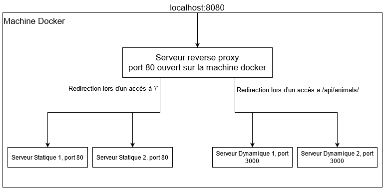

# 1. InfraHTTP

## 1.1. Introduction

...

Chaque étape est décrite dans un fichier md situé dans le dossier [doc](doc) : 

- [Etape 1](doc/Etape-1.md)
- [Etape 2](doc/Etape-2.md)
- [Etape 3](doc/Etape-3.md)
- [Etape 4](doc/Etape-4.md)
- [Etape 5](doc/Etape-5.md)

Pour retrouver l'état de l'étape à ce moment la dans le développement, veuillez changer de branche pour aller sur celle de l'étape de votre choix. Il existe une branche par étape dans le repo github du laboratoire, chacune nommée comme le fichier md qui la décrit : `Etape-x`

## 1.2. Features

En utilisant les 3 images que nous avons developpé notre interface permet : 

- D'offrir un site statique, qui peut être hebergé sur un ou plusieurs serveurs afin de repartir la charge.
- D'offrir un site qui fournit du contenu dynamique. Ce site est actuellement utilisé dans le site static pour rafraichir continuellement la page. 
- D'offrir un serveur reverse proxy, qui est capable de faire du load-balancing sur les différents serveurs disponibles, avec une implémentation en forme de sticky-session pour les serveurs statiques et round-robin pour les serveurs dynamiques.
- D'offrir une structure complétement modulable, qui peut être personalisée pour satifaire différents besoins.

## 1.3. Installation/Utilisation

Les instructions suivantes permettent de créer les différentes images que nous proposons, puis de lancer 2 containers a partir de l'image static, 2 à partir de l'image dynamic et un container qui sert de reverse_proxy. Si vous souhaitez avoir plus de serveurs d'un certain type, changer le host du site, changer le contenu d'un des deux sites,... lisez la documentation qui se trouve dans les fichiers md de chaque image.

Pour build les 3 images de l'infrastructure, il faut exécuter le script build-images :

```bash
./build-images.sh
``` 

Puis en exécutant le script start_containers vous pourrez lancer les 4 containers statiques et dynamiques de l'infrastructure : 

```bash
./start_containers.sh
```

Il ne suffit plus qu'à lancer le container du reverse proxy pour que l'infrastructure soit fonctionnelle. Pour lancer celui ci, il faut lancer la commande : 

```bash
docker run -d --name apache_rp -e STATIC_APP1=172.17.0.2:80 -e STATIC_APP2=172.17.0.3:80 -e DYNAMIC_APP1=172.17.0.4:3000 -e DYNAMIC_APP2=172.17.0.5:3000 -p 8080:80 res/apache_rp
```

Si vous n'aviez aucun container qui tournait lorsque vous avez commencé a lancer les containers pour cette infrastructure et que vous avez lancé d'abord les deux containers statiques, les adresses IP fournies ci-dessus devraient correspondre à celles des différentes instances de vos serveurs statique et dynamiques. Pour être cependant sur qu'elles sont correctes, nous vous conseillons de vérifier d'abbord les adresses des différents containers en utilisant la commande `docker inspect container_name | grep -i ipaddr`, ce qui vous permettra de vérifier l'adresse ip de chaque container. Cette commande permet d'accéder à l'infrastructure à travers le port 8080 de votre machine locale, si vous souhaitez utiliser un port différent, vous pouvez le changer sur la commande ci-dessus.

Pour pouvoir se connecter sur le container il faut utiliser le server name définit dans le [fichier de configuration php](docker-images/apache-reverse-proxy/template/config-template.php) du serveur rp. Si vous voulez utiliser un navigateur pour accéder a votre site, il faut spécifier a votre ordinateur de rediriger les accès a `server name` vers l'adresse ip de votre machine docker (sur windows, il faut aller ajouter dans le fichier *hosts* situé dans le dossier `C:\Windows\System32\drivers\etc` et ajouter la ligne suivante : 

```txt
localhost serverName
```

## 1.4. Structure



Voici ci-dessus un schéma de la structure de notre infrastructure. 

## 1.5. Tests effectués

Pour tester la structure finale de l'in

## 1.6. Ajouts bonus

## 1.7. Adaptation par rapport a la donnée